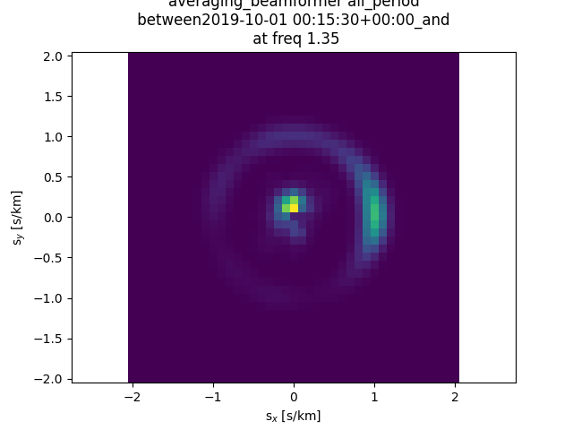

Notebooks for data visualisation
********************************

Some notebooks already exist in order to visualise results.

Open a jupyterlab window:

::

    ssh -L 8853:localhost:5053 XXX@XXX

and fill out the token.

Downloading the notebooks
=========================

In the noiz/src, the user must write:
::

    git clone git@gitlab.com:noiz-group/notebook_data_viz.git

Visualise the psd results
=========================

Plot_psd_vs_frequency
---------------------

The notebook Plot_psd_vs_frequency.ipynb allows to display ppsd results in function of frequencies for a specific time period.
The user must modify the block parameters:

::

    #params for fetching ppsd
    params_datachunk_id = 1
    ppsd_params_id = 1
    qcone_config_id = 1

    ### time period
    starttime = None #'2018-07-15' # "2019-08-10"  # None
    endtime =  None #'2018-07-16' # "2019-08-19" # None

    ## specific time  : each monday for instance between hour_start and hour_end
    starttime_p = '2019-10-01'
    endtime_p = '2019-10-08'
    time_freq = ['W-MON','W-TUE','W-WED','W-THU', 'W-FRI'] #['W-SAT','W-SUN'] 
    # which frequency https://pandas.pydata.org/pandas-docs/stable/user_guide/timeseries.html#timeseries-offset-aliases 

    hour_start_list = [8] #[20] 
    hour_end_list = [18] #[3] 

    ### 
    components = "Z" # None 

    use_same_datachunks = False
    datachunk_ids = None #("1","2") 

    station_list = ["ES03", "ES04", "ES05", "ES09", "ES11", "ES13", "ES203", "ES23", "ES26", "ES29", "ES30", "ES37"]

    dir_plot = "plot_psd/week-day_day"
    os.makedirs(dir_plot, exist_ok = True)

- First, the user has to fill in the Noiz parameters (*params_datachunk_id*, *ppsd_params_id*, *qcone_config_id*), i.e. the processing parameters he has chosen (see step_by_step) to process datachunks, ppsds and QC.
- Secondly, the user has to specify the time period to be analysed. Here, there are two different options. (1) The user requires a continuous time period : he must fill in *starttime* and *endtime* with a date format yyyy-mm-dd and enter "None" for *starttime_p*, *endtime_p*, *time_freq*, *hour_start_list* and *hour_end_list*. (2) The user wants to consider a week and day parts (example : every weekend during night). If so, he must add a date format yyyy-mm-dd for *starttime_p*, *endtime_p* and hours (24h format) for *hour_start_list* and *hour_end_list*. Then, he chooses the repetition frequencies in time_freq. For example, ['W-MON','W-TUE','W-WED','W-THU', 'W-FRI'] for every Monday, Tuesday, Wednesday, Thursday and Friday. All the potential options are available at https://pandas.pydata.org/pandas-docs/stable/user_guide/timeseries.html#timeseries-offset-aliases. Finally, he enters "None" for *starttime* and *endtime*.
- Thirdly, the user enters the components to be studied ("Z", "E" or "N").
- Fourthly, the *use_same_datachunks = True* option allows the user to  consider only time periods with the same working stations. This means that ppsds are computed for the same time period and the same station. If a station is mission, the time period is not taken into account. 
- Fiftly, the user can also decide to specify which datachunk he wants to study (*datachunk_ids*).
- Sixthly, the station name has to be entered into *station_list*.
- Finally, the user must specify where to save the results (*dir_plot*).

The following figure is a ppsd result example:

Plot_psd_spectrogram
--------------------

The notebook Plot_psd_spectrogram.ipynb allows to display ppsd spectrogram results in function of frequencies for a specific time period.
The user must modify the block parameters:

::

    #params for fetching ppsd
    params_datachunk_id = 1
    ppsd_params_id = 1
    qcone_config_id = 1

    ### TIME
    starttime = '2019-10-01'
    endtime = '2019-10-08'

    ### 
    components = "Z" # None 
    datachunk_ids = None #("1","2")
    use_same_datachunks = False

    station_list = ["ES03", "ES04", "ES05", "ES09", "ES11", "ES13", "ES203", "ES23", "ES26", "ES29", "ES30", "ES37"]#

    dir_plot = "plot_psd_spectrogram/"

    os.makedirs(dir_plot, exist_ok = True)

- First, the user has to fill in the Noiz parameters (*params_datachunk_id*, *ppsd_params_id*, *qcone_config_id*), i.e. the processing parameters he has chosen (see step_by_step) to process datachunks, ppsds and QC.
- Secondly, the user has to specify the time period to be analysed, which is acontinuous time period. He must fill in *starttime* and *endtime* with a date format yyyy-mm-dd.
- Thirdly, the user enters the components to be studied ("Z", "E" or "N").
- Fourthly, the *use_same_datachunks = True* option allows the user to  consider only time periods with the same working stations. This means that ppsds are computed for the same time period and the same station. If a station is mission, the time period is not taken into account. 
- Fiftly, the user can also decide to specify which datachunk he wants to study (*datachunk_ids*).
- Sixthly, the station name has to be entered into *station_list*.
- Finally, the user must specify where to save the results (*dir_plot*).

The following figure is a ppsd spectrogram result example for station ES03:

Plot_psd_time_evolution_for_given_frequency
--------------------------------------------

The notebook PPlot_psd_time_evolution_for_given_frequency.ipynb allows to display ppsd for a given frequency interval in function of time.
The user must modify the block parameters:

::

    #params for fetching ppsd
    params_datachunk_id = 1
    ppsd_params_id = 1
    qcone_config_id = 1

    ### TIME
    starttime = None # "2019-08-10"  # None
    endtime =  None #  "2019-08-19" # None

    ## specific time period : each monday for instance between hour_start and hour_end
    starttime_p = '2019-10-01'
    endtime_p = '2019-10-08'
    time_freq = ['W-MON','W-TUE','W-WED','W-THU', 'W-FRI'] #['W-SAT','W-SUN'] #
    # which frequency https://pandas.pydata.org/pandas-docs/stable/user_guide/timeseries.html#timeseries-offset-aliases 

    hour_start_list =  [8] # [20] # 
    hour_end_list = [18] # [3] # 

    ### 
    components = "Z" # None 
    datachunk_ids = None #("1","2") 
    station_list =  ["ES03", "ES04", "ES05", "ES09", "ES11", "ES13", "ES203", "ES23", "ES26", "ES29", "ES30", "ES37"]

    sta_ref = "ES03"

    ## frequency interval for time evolution
    freq_inter = [0.5,1] #  [1,2] # [2,3] #

    averaging_option = "day"

    dir_plot = "psd_time_ev/week-day_day"
    os.makedirs(dir_plot, exist_ok = True)

- First, the user has to fill in the Noiz parameters (*params_datachunk_id*, *ppsd_params_id*, *qcone_config_id*), i.e. the processing parameters he has chosen (see step_by_step) to process datachunks, ppsds and QC.
- Secondly, the user has to specify the time period to be analysed. Here, there are two different options. (1) The user requires a continuous time period : he must fill in *starttime* and *endtime* with a date format yyyy-mm-dd and enter "None" for *starttime_p*, *endtime_p*, *time_freq*, *hour_start_list* and *hour_end_list*. (2) The user wants to consider a week and day parts (example : every weekend during night). If so, he must add a date format yyyy-mm-dd for *starttime_p*, *endtime_p* and hours (24h format) for *hour_start_list* and *hour_end_list*. Then, he chooses the repetition frequencies in time_freq. For example, ['W-MON','W-TUE','W-WED','W-THU', 'W-FRI'] for every Monday, Tuesday, Wednesday, Thursday and Friday. All the potential options are available at https://pandas.pydata.org/pandas-docs/stable/user_guide/timeseries.html#timeseries-offset-aliases. Finally, he enters "None" for *starttime* and *endtime*.
- Thirdly, the user enters the components to be studied ("Z", "E" or "N").
- Fourthly, the user can also decide to specify which datachunk he wants to study (*datachunk_ids*).
- Fiftly, the station names have to be entered into *station_list*.
- Sixthly, a reference station has to be defined.
- Seventhly, the frequency interval must be complete (from minimal frequency to maximal frequency).
- Heighthly, the user must choose the time period *averaging_option* (day, week, month) for averaging the results and simplified the displaying. Thus, for a year of data, the best is a "month" averaging; whereas for a week of data, a "day" averaging is a good option.
- Finally, the user must specify where to save the results (*dir_plot*).

The following figure is a ppsd time evolution figure example:

    
Plot_psd_mapping
--------------------------------------------

The notebook Plot_psd_mapping.ipynb allows to display spatial and temporel ppsd results for a given frequency.
Before running the script, the user must go into /noiz and writes:
::

    pip install shapely

The user must modify the block parameters:

::

    #params for fetching ppsd
    params_datachunk_id = 1
    ppsd_params_id = 1
    qcone_config_id = 1

    ### TIME
    starttime = None # "2019-10-01"  # None
    endtime =  None # "2019-10-08" # None

    ## specific time period : each monday for instance between hour_start and hour_end
    starttime_p = '2019-10-01'
    endtime_p = '2019-10-08'
    time_freq =  ['W-MON','W-TUE','W-WED','W-THU', 'W-FRI']  #['W-MON','W-TUE','W-WED','W-THU', 'W-FRI'] #['W-SAT','W-SUN'] 
    # which frequency https://pandas.pydata.org/pandas-docs/stable/user_guide/timeseries.html#timeseries-offset-aliases 

    hour_start_list = [8] #[20] 
    hour_end_list = [18] #[4] 

    ### 
    components = "Z" 
    datachunk_ids = None #("1","2") #None

    use_same_datachunks = True

    station_list = ["ES03", "ES04", "ES05", "ES09", "ES11", "ES13", "ES203", "ES23", "ES26", "ES29", "ES30", "ES37"]
    sta_ref = "ES03"

    ## rejection station parameters
    reject_station_p = True
    fcut1 = 0.1
    fcut2 = 1
    q1val = 0.1
    q2val = 0.9
    n_thresh_std = 2
    prop_bad_freqs = 0.5

    ##plot 
    freq_min = 0.75
    freq_max = 2 
    freq_step = 0.25

    colormesh = False

    averaging_option = "day"

    dir_plot = "psd_mapping/"
    os.makedirs(dir_plot, exist_ok = True)

- First, the user has to fill in the Noiz parameters (*params_datachunk_id*, *ppsd_params_id*, *qcone_config_id*), i.e. the processing parameters he has chosen (see step_by_step) to process datachunks, ppsds and QC.
- Secondly, the user has to specify the time period to be analysed. Here, there are two different options. (1) The user requires a continuous time period : he must fill in *starttime* and *endtime* with a date format yyyy-mm-dd and enter "None" for *starttime_p*, *endtime_p*, *time_freq*, *hour_start_list* and *hour_end_list*. (2) The user wants to consider a week and day parts (example : every weekend during night). If so, he must add a date format yyyy-mm-dd for *starttime_p*, *endtime_p* and hours (24h format) for *hour_start_list* and *hour_end_list*. Then, he chooses the repetition frequencies in time_freq. For example, ['W-MON','W-TUE','W-WED','W-THU', 'W-FRI'] for every Monday, Tuesday, Wednesday, Thursday and Friday. All the potential options are available at https://pandas.pydata.org/pandas-docs/stable/user_guide/timeseries.html#timeseries-offset-aliases. Finally, he enters "None" for *starttime* and *endtime*.
- Thirdly, the user enters the components to be studied ("Z", "E" or "N").
- Fourthly, the user can also decide to specify which datachunk he wants to study (*datachunk_ids*).
- Fiftly, the *use_same_datachunks = True* option allows the user to  consider only time periods with the same working stations. This means that ppsds are computed for the same time period and the same station. If a station is mission, the time period is not taken into account. 
- Sixthly, the station names have to be entered into *station_list*.
- Seventhly, a reference station has to be defined *sta_ref*.
- Heighthly, the statistical automatic station rejection parameters must be complete: *reject_station_p = True* means the user wants to perform an automatic station rejection; *cut1* and *fcut2* are the minimum and maximum cutting frequencies, respectively; *q1val* and *q2val* are the first and second quantiles, respectively; *n_thresh_std* is the standard deviation threshold; and *prop_bad_freqs* is the wrong frequency proportion.
- Ninthly, the plot parameters are defined : *freq_min*, *freq_max*, *freq_step*  are the frequency information to create a frequency interval to plot maps.
- Tenthly, the *colormesh* option allows the user to choose between colormesh map (True) or scatter plot (False).
- Eleventhly, the user must choose the time period *averaging_option* (day, week, month) for averaging the results and simplified the displaying. Thus, for a year of data, the best is a "month" averaging; whereas for a week of data, a "day" averaging is a good option.
- Finally, the user must specify where to save the results (*dir_plot*).

The following figure is a ppsd map example:

Visualise the cross-correlation results
=======================================

Plot_xcorr_shotgather
---------------------
The notebook Plot_xcorr_shotgather.ipynb allows to display cross-correlation shotgathers.
The user must modify the block parameters:

::

    datachunk_params_id = 1 
    crosscorrelation_cartesian_params_id = 1

    starttime = UTCDateTime(2019,10,1,0,0,0) # starttime
    endtime = UTCDateTime(2019,10,8,0,0,0) # endtime

    ## specific time period : each monday for instance between hour_start and hour_end
    starttime_p =   None #'2019-01-01'
    endtime_p =   None #'2019-01-08'
    time_freq =  None #['W-SAT','W-SUN'] # ['W-MON','W-TUE','W-WED','W-THU', 'W-FRI'] #
    # which frequency https://pandas.pydata.org/pandas-docs/stable/user_guide/timeseries.html#timeseries-offset-aliases 

    hour_start_list = None #[20] # [8] #
    hour_end_list =  None #[3] #  [18] #

    accepted_component_code_pairs = ["ZZ"] #["EE", "NN", "ZZ"] # list of component pair to consider
    comp_pair_cart = None # choice id component pair cart

    bin_size = 100
    scale_factor = 10**3

    dir_plot = "plot_shotgather"
    os.makedirs(dir_plot, exist_ok = True)

- First, the user has to fill in the Noiz parameters (*datachunk_params_id*, *crosscorrelation_cartesian_params_id*), i.e. the processing parameters he has chosen (see step_by_step) to process datachunks, and cross-correlations.
- Secondly, the user has to specify the time period to be analysed. Here, there are two different options. (1) The user requires a continuous time period : he must fill in *starttime* and *endtime* with a date format yyyy-mm-dd and enter "None" for *starttime_p*, *endtime_p*, *time_freq*, *hour_start_list* and *hour_end_list*. (2) The user wants to consider a week and day parts (example : every weekend during night). If so, he must add a date format yyyy-mm-dd for *starttime_p*, *endtime_p* and hours (24h format) for *hour_start_list* and *hour_end_list*. Then, he chooses the repetition frequencies in time_freq. For example, ['W-MON','W-TUE','W-WED','W-THU', 'W-FRI'] for every Monday, Tuesday, Wednesday, Thursday and Friday. All the potential options are available at https://pandas.pydata.org/pandas-docs/stable/user_guide/timeseries.html#timeseries-offset-aliases. Finally, he enters "None" for *starttime* and *endtime*.
- Thirdly, the user enters the component pairs to be studied ("ZZ", "ZE", "ZN", "NN", "NZ", "NE","EE", "EZ", "EN", ) in *accepted_component_code_pairs*.
- Fourthly, the user can also decide to specify which component pairs he wants to study by entering their identification numbers (*comp_pair_cart*).
- Fiftly, the *bin_size* and *scale_factor* parameters are required for the figure displaying. The bin_size is a distance (between station)  and the scale_factor is used for better waveform visualisation (normally it has not to be modified).
- Finally, the user must specify where to save the results (*dir_plot*).

The following figure is a cross-correlation shotgather example:

Plot_xcorr
-----------

The notebook Plot_xcorr.ipynb allows to display cross-correlation results.
The user must modify the block parameters:

::

    datachunk_params_id = 1 
    crosscorrelation_cartesian_params_id = 1

    starttime = UTCDateTime(2019,10,1,0,0,0) # starttime
    endtime = UTCDateTime(2019,10,8,0,0,0) # endtime

    ## specific time period : each monday for instance between hour_start and hour_end
    starttime_p =  None #'2019-10-01'
    endtime_p = None #'2010-10-08'
    time_freq =  None # ['W-MON','W-TUE','W-WED','W-THU', 'W-FRI'] #['W-MON','W-TUE','W-WED','W-THU', 'W-FRI'] #['W-SAT','W-SUN'] 
    # which frequency https://pandas.pydata.org/pandas-docs/stable/user_guide/timeseries.html#timeseries-offset-aliases 

    hour_start_list = None # [8] #[20] 
    hour_end_list = None #[18] #[3] 

    accepted_component_code_pairs = ["ZZ"] #["EE", "NN", "ZZ"] # list of component pair to consider
    comp_pair_cart_ids= None #120 # choice id component pair cart

    #if filtering xcorr
    f_min = np.nan
    f_max = np.nan
    order_fit = 4

    #averaging
    averaging = False

    legend_time_option = "day"

    #plot figure
    max_lag_len = 10

    dir_plot = "plot_x_corr"
    os.makedirs(dir_plot, exist_ok = True)

- First, the user has to fill in the Noiz parameters (*datachunk_params_id*, *crosscorrelation_cartesian_params_id*), i.e. the processing parameters he has chosen (see step_by_step) to process datachunks, and cross-correlations.
- Secondly, the user has to specify the time period to be analysed. Here, there are two different options. (1) The user requires a continuous time period : he must fill in *starttime* and *endtime* with a date format yyyy-mm-dd and enter "None" for *starttime_p*, *endtime_p*, *time_freq*, *hour_start_list* and *hour_end_list*. (2) The user wants to consider a week and day parts (example : every weekend during night). If so, he must add a date format yyyy-mm-dd for *starttime_p*, *endtime_p* and hours (24h format) for *hour_start_list* and *hour_end_list*. Then, he chooses the repetition frequencies in time_freq. For example, ['W-MON','W-TUE','W-WED','W-THU', 'W-FRI'] for every Monday, Tuesday, Wednesday, Thursday and Friday. All the potential options are available at https://pandas.pydata.org/pandas-docs/stable/user_guide/timeseries.html#timeseries-offset-aliases. Finally, he enters "None" for *starttime* and *endtime*.
- Thirdly, the user enters the component pairs to be studied ("ZZ", "ZE", "ZN", "NN", "NZ", "NE","EE", "EZ", "EN", ) in *accepted_component_code_pairs*.
- Fourthly, the user can also decide to specify which component pairs he wants to study by entering their identification numbers (*comp_pair_cart*).
- Fiftly, the user can filter the seismic data between *f_min* and *f_max* with the order *order_fit*. If the user does not want to filt the data, he has to enter np.nan to *f_min* and *f_max*.
- Sixthly, the *averaging* option consists of averaging the causal and acausal part of the cross-correlations.
- Seventhly, the *legend_time_option* option allows the user to control the legend time axis (by defining if the interval is in day, week or month).
- Heighthly, the user can restreint the cross-correlation time lags axis to *max_lag_len* in seconds.
- Finally, the user must specify where to save the results (*dir_plot*).

The following figure is a cross-correlation example for a station couple:

Visualise the beamforming results
=================================

Plot_beamformer_histograms
--------------------------

The notebook Plot_beamformer_histograms.ipynb allows to display six different results: a histogram of the slowness versus frequencies, a histogram of the East slowness versus North slowness, a histogram of the backazimuth versus frequencies, a histogram of the slowness versus time, a histogram of the azimuth versus time, and a slowness spectrogram.

The user must modify the block parameters:
::

    bf_id = np.arange(1, 41, 1)
    bf_params_id = [int(idd) for idd in bf_id]

    starttime = UTCDateTime(2019,10,1,0,0,0) # starttime
    endtime = UTCDateTime(2019,10,8,0,0,0) # endtime

    ## specific time period : each monday for instance between hour_start and hour_end
    starttime_p = None # '2018-10-01'
    endtime_p =  None #'2019-10-08'
    time_freq = None #['W-SAT','W-SUN'] #['W-MON','W-TUE','W-WED','W-THU', 'W-FRI'] #['W-SAT','W-SUN'] 
    # which frequency https://pandas.pydata.org/pandas-docs/stable/user_guide/timeseries.html#timeseries-offset-aliases 

    hour_start_list = None #[8] #  [8] #[20] 
    hour_end_list =  None #[18] #[18] #[4] 

    # peak_to_select
    peak_to_select = "AVG_REL" #"AVG_ABS" "ALL_REL" "AVG_REL"

    #histo azimuth vs frequency
    bin_edges_ba = np.arange(-180, 180+0.5, 5)
    smin=0
    smax=1.5

    freq_central_to_use = 1.5

    dir_plot = "plot_beamforming_histo2D_deconv"
    os.makedirs(dir_plot, exist_ok = True)

    #CUTOFF POUR RELPOWER
    cut_off_amplitude = None #0.2

- First, the user has to fill in  *bf_id* : those are the beamforming parameters from the smallest (here,1) to the highest (here, 41) with the step (here, 1).
- Secondly, the user has to specify the time period to be analysed. Here, there are two different options. (1) The user requires a continuous time period : he must fill in *starttime* and *endtime* with a date format yyyy-mm-dd and enter "None" for *starttime_p*, *endtime_p*, *time_freq*, *hour_start_list* and *hour_end_list*. (2) The user wants to consider a week and day parts (example : every weekend during night). If so, he must add a date format yyyy-mm-dd for *starttime_p*, *endtime_p* and hours (24h format) for *hour_start_list* and *hour_end_list*. Then, he chooses the repetition frequencies in time_freq. For example, ['W-MON','W-TUE','W-WED','W-THU', 'W-FRI'] for every Monday, Tuesday, Wednesday, Thursday and Friday. All the potential options are available at https://pandas.pydata.org/pandas-docs/stable/user_guide/timeseries.html#timeseries-offset-aliases. Finally, he enters "None" for *starttime* and *endtime*.
- Thirdly, the user enters the peaks to extract in *peak_to_select*. Four options are available : "AVG_REL" for averaging relative power, "AVG_ABS" for averaging absolute power, "ALL_REL" for all relative power and "ALL_REL" for all relative power.
- Fourthly, the user has to choose the backazimuth limits *bin_edges_ba* in degrees, the minimum slowness *smin*, and the maximum slowness *smax*.
- Fiftly, the *freq_central_to_use* is the frequency to study.
- Sixthly, the user must specify where to save the results (*dir_plot*).
- Finally, when the "REL" option is used, a cutofff must be applied to the dataset.

The following figures are examples of beamforming histogram results:

.. image:: _images_notebooks/7_beamforming_backazimuth_freq_avg_peak_relpower.png

fetch_beamformers
-----------------

The script fetch_beamformers.py is a python script used to fetch the beamformer results.
It creates a csv file, which will be called by all other beamforming notebooks.

The user has to modify these lines:

::

    bf_params_id = [1, 2, 3, 4, 5, 6, 7, 8, 9, 10, 11, 12, 13, 14, 15, 16, 17, 18, 19, 20,
                    21, 22, 23, 24, 25, 26, 27, 28, 29, 30, 31, 32, 33, 34, 35, 36, 37, 38, 39, 40]

    starttime = UTCDateTime(2019,10,1,0,0,0) # starttime
    endtime = UTCDateTime(2019,10,8,0,0,0) # endtime

    ## specific time period : each monday for instance between hour_start and hour_end
    starttime_p = None #'2019-10-01'
    endtime_p =  None #'2019-10-08'
    time_freq =   None # ['W-MON','W-TUE','W-WED','W-THU', 'W-FRI'] #['W-SAT','W-SUN'] #
    # which frequency https://pandas.pydata.org/pandas-docs/stable/user_guide/timeseries.html#timeseries-offset-aliases 

    hour_start_list = None # [8] #[20] #[8]
    hour_end_list =  None # [18] #[4] #[16] 

    components = "Z"

    name_cvs = "bf_deconv_Z_"

- First, the user has to fill in  *bf_params_id* : those are the beamforming parameters.
- Secondly, the user has to specify the time period to be analysed. Here, there are two different options. (1) The user requires a continuous time period : he must fill in *starttime* and *endtime* with a date format yyyy-mm-dd and enter "None" for *starttime_p*, *endtime_p*, *time_freq*, *hour_start_list* and *hour_end_list*. (2) The user wants to consider a week and day parts (example : every weekend during night). If so, he must add a date format yyyy-mm-dd for *starttime_p*, *endtime_p* and hours (24h format) for *hour_start_list* and *hour_end_list*. Then, he chooses the repetition frequencies in time_freq. For example, ['W-MON','W-TUE','W-WED','W-THU', 'W-FRI'] for every Monday, Tuesday, Wednesday, Thursday and Friday. All the potential options are available at https://pandas.pydata.org/pandas-docs/stable/user_guide/timeseries.html#timeseries-offset-aliases. Finally, he enters "None" for *starttime* and *endtime*.
- Thirdly, the user enters the components to be studied ("Z", "E" or "N").
- Finally, the user must specify a part of the saving file(*name_cvs*).

Then, the script will be run:

::

    python fetch_beamformers.py

and a csv file containing results is created.

Plot_beamformers
-----------------

The notebook Plot_beamformers.ipynb allows to display beamformers for a given time and frequency as well as an averaged beamformer for the whole time period.

The user has to modify the following block:
::

    csv_to_read = "bf_deconv_Z_df_beamformer_from_2018-07-15T00:00:00.000000Z_to_2018-07-16T00:00:00.000000Z.csv"
    
    if "Week-end-Night" in csv_to_read:
        part_name = "Week-end-Night"
    elif "Week-day-Day" in csv_to_read:
        part_name = "Week-day-Day"
    else:
        part_name = "all_period"

    toplot = "avg_abs_pow_deconv"

    dir_plot = "plot_beamforming"
    os.makedirs(dir_plot, exist_ok = True)

- First, *csv_to_read* is the name of the csv file created by fetch_beamformers.
- Secondly, the user enters the results to display in *toplot* option.
- Finally, the user must specify where to save the results (*dir_plot*).

