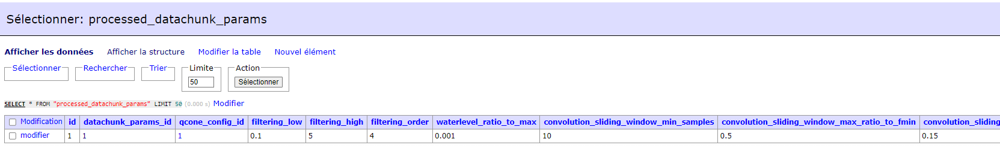

A step by step user guide
****************************

This tutorial provides a step-by-step guide to learning how to use the main Noiz command.
Some examples of toml files can be found in the toml_files folder.
The tutorial below has been built using these toml files.

Noiz command group
==================

Noiz has four different command types: data, configs, processing and plot. Each of these groups contains several commands.

Thus, noiz data consists of the loading of seismic instruments and data information from seismic data in SEED format, i.e. station locations, instrument response, data indexing (where it is stored) ....

Then, noiz configs allows the user to choose the processing parameters: filter, overlap, etc. .... These will then be used to process the data. 

Third, noiz processing is the data processing step. With the corresponding parameter configuration (noiz configs step), noiz will process the seismic data (indexed in the noiz data step). 

Finally, noiz plot allows plotting seismic results (obtained from noiz processing).

Database Migration
==================
The first step is to migrate and update the database. 
For doing such a thing, the user must run the following two commands:

::
    
    noiz db migrate

::

    noiz db upgrade

The INFO logger provides information about loading database tables.
The empty database looks like this: 

Seismic station information
===========================

Now, the seismic data processing step can start.
The seismic instrument information needs to be loaded into the database. 
This information is read into an xml inventory (SEED format) by running the command:

::
    
    noiz data add_inventory /SDS/station.xml

Thus, device, components and componentpair_cartesian tables will be filled. 

.. image:: _images/6_componentpair_cartesian.PNG

This step can be quite long depending on the used dataset. 

The INFO logger displays running information as well as when results are committed:

Seismic data information
========================

The next step requires to fill the tsindex table with the seismic data information by running:
::

    noiz data add_seismic_data /SDS/seismic-data/SDS/2019/EN/

The tsindex table is now complete:

Timespans
==========

The user must define the time period to be used for processing the seismic data. 
This must be smaller or equal to the station working time.
::
    
    noiz data add_timespans -sd 2019-10-01 -ed 2019-10-08 -wl 1860 -wo 60 --generate_over_midnight 

where

-sd : is the start time,

-ed : is the end time,

-wl is the windows length of a datachunk,

-wo is the overlap window between 2 datachunks,

--generate_over_midnight is for taking into account the day change. 

This step requires user interaction. He must answer the API question with Y (yes) or N (no).

The user can check if the information is well implemented in the database:

The noise data step is now complete. 
All the necessary seismic information has been implemented in the database.

The new steps will alternate between noiz configs (parameter selection) and noiz processing (seismic data processing).

Datachunks creation
===================

Adding datachunk parameters
---------------------------

The user must select the parameters to be applied to the seismic data to create datachunks.
The parameters are listed in a tolm file: datachunk_params.toml

Then, he runs the following command:
::
    
    noiz configs add_datachunk_params -f /SDS/param_toml/datachunk_params_p1.toml

This step requires user interaction. He must answer the API question with Y (yes) or N (no).

The API returns an identification number, here 1.
This id refers to the defined parameters and the user must then refer to it to process the data.

The chosen parameters are stored in the database:

Running datachunk creation
--------------------------

To prepare the datachunks according to the selected parameters, the user runs the following command
::
    
    noiz processing prepare_datachunks -sd 2019-10-01 -ed 2019-10-08 -p1

where -p is the datachunk parameter identifier.

The created datachunks are stored in the database:

GPS and instrument information checking : soh
==============================================

Check the GPS time and the instrument operating time. 
This information is stored in the database for future use.

For the station ES03, the user runs the following command:
::
    
    noiz data add_soh_dir -s ES03 -t centaur -p gnsstime /SDS/soh-data/ES03/2019/ && sleep 10s && noiz data add_soh_dir -s ES03 -t centaur -p instrument /SDS/soh-data/ES03/2019/ 

where,

-s is for the station name : ES03/ES04... ,

-t is for the instrument : centaur or taurus,

-p is for gnsstime, instrument or miniseed_gpstime if centaur station or gpstime, instrument if taurus station,

-- && sleep 10s && allows the user to automatically run one command after another.

The INFO logger displays such information:

The command line is repeat for all stations: 
::
    noiz data add_soh_dir -s ES03 -t centaur -p gnsstime /SDS/soh-data/ES03/2019/ && sleep 10s && noiz data add_soh_dir -s ES03 -t centaur -p instrument /SDS/soh-data/ES03/2019/ && sleep 10s &&     noiz data add_soh_dir -s  ES05  -t centaur -p instrument /SDS/soh-data/ES05/2019/ && sleep 10s && noiz data add_soh_dir -s ES05 -t centaur -p gnsstime /SDS/soh-data/ES05/2019/ && sleep 10s && noiz data add_soh_dir -s ES11 -t centaur -p instrument /SDS/soh-data/ES11/2019/ && sleep 10s && noiz data add_soh_dir -s ES11 -t centaur -p gnsstime /SDS/soh-data/ES11/2019/ && sleep 10s && noiz data add_soh_dir -s ES13 -t centaur -p instrument /SDS/soh-data/ES13/2019/ && sleep 10s && noiz data add_soh_dir -s ES13 -t centaur -p gnsstime /SDS/soh-data/ES13/2019/ && sleep 10s && noiz data add_soh_dir -s ES29 -t centaur -p instrument /SDS/soh-data/ES29/2019/ && sleep 10s && noiz data add_soh_dir -s ES29 -t centaur -p gnsstime /SDS/soh-data/ES29/2019/ && sleep 10s && noiz data add_soh_dir -s ES37 -t centaur -p instrument /SDS/soh-data/ES37/2019/ && sleep 10s && noiz data add_soh_dir -s ES37 -t centaur -p gnsstime /SDS/soh-data/ES37/2019/ && sleep 10s && noiz data add_soh_dir -s ES04 -t taurus -p instrument /SDS/soh-data/ES04/2019/ && sleep 10s && noiz data add_soh_dir -s ES04 -t taurus -p gpstime /SDS/soh-data/ES04/2019/ && sleep 10s && noiz data add_soh_dir -s ES203 -t taurus -p instrument /SDS/soh-data/ES203/2019/ && sleep 10s && noiz data add_soh_dir -s ES203 -t taurus -p gpstime /SDS/soh-data/ES203/2019/ && sleep 10s && noiz data add_soh_dir -s ES23 -t taurus -p instrument /SDS/soh-data/ES23/2019/ && sleep 10s && noiz data add_soh_dir -s ES23 -t taurus -p gpstime /SDS/soh-data/ES23/2019/ && sleep 10s && noiz data add_soh_dir -s ES26 -t taurus -p instrument /SDS/soh-data/ES26/2019/ && sleep 10s && noiz data add_soh_dir -s ES26 -t taurus -p gpstime /SDS/soh-data/ES26/2019/ && sleep 10s && noiz data add_soh_dir -s ES30 -t taurus -p instrument /SDS/soh-data/ES30/2019/ && sleep 10s && noiz data add_soh_dir -s ES30 -t taurus -p gpstime /SDS/soh-data/ES30/2019/ 

Afterwars, the users runs:
::
    noiz processing average_soh_gps -sd 2019-10-01 -ed 2019-10-08 

The average_soh_gps table is, thus, completed:

and:

::

    noiz processing calc_datachunk_stats -sd 2019-10-01 -ed 2019-10-08 -p1

The table datachunk_stats is, also, filled out:

All the information stored in the database using these different commands will, then, allow the user to perform automatic QC based on GPS time.

Automatic QC
============

qcone
-----

An automatic QC can be performed to exclude stations that do not fit the required parameters in QCOneConfig.toml for a specified time period.
If a station does not fit a specified limit, an "f" for false is added to the table qcone.
To pass the qcone, the station must have only  "t" for True for all parameters.

First, the following command has to be run to set the parameters:
::
    noiz configs add_qcone_config -f /SDS/param_toml/QCOneConfig.toml

This step requires user interaction. He must answer the API question with Y (yes) or N (no).

The API returns an identification number, here 1.
This id refers to the defined parameters and the user must then refer to it to process the QC data.

The chosen parameters are stored in the database:

.. image:: _images/22_qcone_db.PNG

To run the qcone according to the selected parameters, the user runs the following command
::
    
    noiz processing run_qcone -sd 2019-10-01 -ed 2019-10-08 -p1

where -p is the qcone parameter identifier.

The qcone results are stored in the database:

PPSD
====

The psd (power spectral density) can be computed using Noiz.

The following command has to be run to set the parameters:
::
    
    noiz configs add_ppsd_params -f /SDS/param_toml/ppsd_params.toml

This step requires user interaction. He must answer the API question with Y (yes) or N (no).

The API returns an identification number, here 1.
This id refers to the defined parameters and the user must then refer to it to compute the psds.

The chosen parameters are stored in the database (ppsd_params table):

.. image:: _images/25_ppsd_config_db.PNG

To run the ppds according to the selected parameters, the user runs the following command
::
    
    noiz processing run_ppsd -sd 2019-10-01 -ed 2019-10-08 -p1

where -p is the ppsd parameter identifier.

The ppsd results are stored in the database (ppsd_result table):

Cross-correlations in cartesian components
===========================================

The cross-correlation computation requires a first pre-processing step, called process_datachunks.

process_datachunks
------------------

The following command has to be run to set the parameters:
::
    noiz configs add_processed_datachunk_params -f /SDS/param_toml/processed_datachunk_params.toml

This step requires user interaction. He must answer the API question with Y (yes) or N (no).

The API returns an identification number, here 1.
This id refers to the defined parameters and the user must then refer to it to process the "processed datachunks".

The chosen parameters are stored in the database:

To run the processed_datachunks according to the selected parameters, the user runs the following command
::
    
    noiz processing process_datachunks -sd 2019-10-01 -ed 2019-10-08 -p1

where -p is the processed_datachunks parameter identifier.

The processed_datachunks results are stored in the database (table: processeddatachunk):

.. image:: _images/29_process_data_db.PNG

Cross-correlations in cartesian components
------------------------------------------

The following command has to be run to set the parameters:
::

    noiz configs add_crosscorrelation_cartesian_params -f /SDS/param_toml/crosscorrelation_cartesian_params.toml

This step requires user interaction. He must answer the API question with Y (yes) or N (no).

The API returns an identification number, here 1.
This id refers to the defined parameters and the user must then refer to it to compute the cartesian cross-correlations.

The chosen parameters are stored in the database:

To run the cartesian cross-correlations according to the selected parameters, the user runs the following command
::
    
    noiz processing run_crosscorrelations_cartesian -sd 2019-10-01 -ed 2019-10-08 -p1 -b125

where,

-p is the cartesian cross-correlations parameter identifier,
-b is the batch size. 
-c is an option allowing to choose the component pair to use (ZZ, EE, NN, EZ, EN, NZ, NE, ZE,ZN).

The cartesian cross-correlations results are stored in the database (table: crosscorrelation_cartesiannew):

Beamforming
===========

Beamformers need to be calculated for different frequencies.
The "configs" command creates several sets of parameters according to a frequency range.

The following command has to be run to set the parameters:
::
    
    noiz configs generate_beamforming_params -f /SDS/param_toml/beamforming_params.toml -fn 0.05 -fx 2.05 -fp 0.05 -fw 0.1

where,

-fn is the lowest frequency,
-fx is the highest frequency, 
-fp is the step to go from fn to fx,
-fw is the frequency window.

This step requires user interaction. He must answer the API question with Y (yes) or N (no).

.. image:: _images/33_beamforming_params_db.PNG

The API returns an identification number, here 1.
This id refers to the defined parameters and the user must then refer to it to compute the beamformers.

The chosen parameters are stored in the database:

To compute the beamformers according to the selected parameters, the user runs the following command
::
    
    noiz processing run_beamforming -sd 2019-10-01 -ed 2019-10-08 -p1 -p2 -p3 -p4 -p5 -p6 -p7 -p8 -p9 -p10 -p11 -p12 -p13 -p14 -p15 -p16 -p17 -p18 -p19 -p20 -p21 -p22 -p23 -p24 -p25 -p26 -p27 -p28 -p29 -p30 -p31 -p32 -p33 -p34 -p35 -p36 -p37 -p38 -p39 -p40 -b1000 

where -p are the beamfomer parameter identifiers.

The following tables are filled according to the chosen option in the toml file:

- beamforming_association_datachunks 

- beamforming_file

- beamforming_peak_all_abspower

- beamforming_peak_all_relpower

- beamforming_peak_average_abspower

- beamforming_peak_average_relpower

- beamforming_result

- beamforming_result_association_all_abspower

- beamforming_result_association_rel_abspower

- beamforming_result_association_avg_abspower

- beamforming_result_association_avg_relpower

Cross-correlations in cylindrical coordinates
=============================================

Before computing and inserting cross-correlations in cylindrical coordinates, the components in cylindrical coordinates have to be creates.
The following command has to be run to create and insert the :
::

    noiz data add_cylindrical_componentpair

Thus, componentpair_cylindrical table will be filled. 

